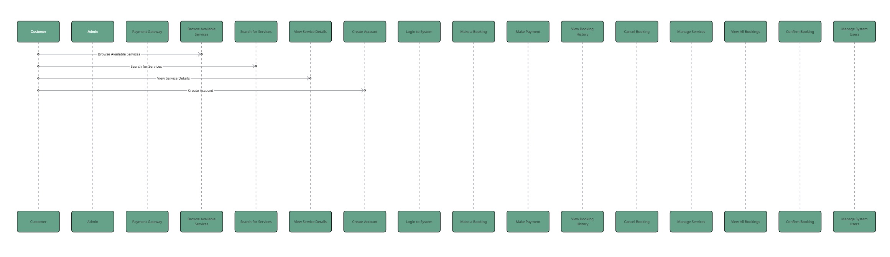

# Requirement Analysis
# What is Requirement Analysis?
Requirement Analysis is a critical phase in the software development life cycle (SDLC) where the needs and conditions of a new or altered product are meticulously examined and documented. It is the process of defining, documenting, and maintaining requirements to bridge the gap between a high-level business objective and the detailed technical specifications needed to build the correct system. The core objective is to identify the what, not the how.

# Why is Requirement Analysis Important?
Requirement analysis is fundamental to project success for several key reasons:

Reduces Risk: Minimizes the chances of project failure, budget overruns, and missed deadlines by identifying ambiguities and contradictions early.

Aligns Stakeholders: Ensures that developers, testers, business analysts, and clients have a shared and unambiguous understanding of what is to be built.

Forms the Foundation: Serves as the basis for project planning, design, development, and testing. Every subsequent phase depends on its accuracy.

Manages Scope: A well-defined requirements document helps prevent uncontrolled changes in project scope ("scope creep") by providing a clear baseline.

Increases Quality: Clear, testable requirements lead to a higher-quality final product that meets user expectations and business goals.

# Key Activities in Requirement Analysis
The process is typically broken down into five interconnected activities:

1. Requirement Elicitation

Brief Detail: This is the discovery phase. It involves actively engaging with stakeholders (users, clients, domain experts) to gather information about their needs, constraints, and the environment in which the system will operate.

Explanation: It's not just about asking what they want; it's about understanding their underlying problems and business processes. Common techniques include interviews, workshops, surveys, observation, and brainstorming. The challenge is to extract unstated or assumed requirements.

2. Requirement Gathering

Brief Detail: This is the collection and consolidation of all information discovered during elicitation. It involves bringing together requirements from various sources and stakeholders.

Explanation: Often used interchangeably with "Elicitation," but gathering is more about the act of collecting, while elicitation is about the techniques used to extract. The output is a raw, often unorganized, set of needs and wishes.

3. Requirement Analysis and Modeling

Brief Detail: This is the structuring and refinement phase. The raw requirements are analyzed for clarity, completeness, consistency, and feasibility. They are then organized and modeled to be easily understood.

Explanation: Analysts break down high-level requirements into detailed functional and non-functional ones. Models like Use Case Diagrams, Flowcharts, ER Diagrams, and User Stories are created to visualize system behavior, data, and processes, making complex requirements easier to communicate and validate.

4. Requirement Documentation

Brief Detail: This is the formal recording of the analyzed requirements into a clear, structured, and comprehensive document.

Explanation: The most common output is a Software Requirements Specification (SRS) document. This document is the single source of truth, describing all functional and non-functional requirements, user interfaces, and system constraints. It must be unambiguous and accessible to both technical and non-technical stakeholders.

5. Requirement Validation

Brief Detail: This is the verification and sign-off phase. It ensures that the documented requirements accurately reflect the stakeholders' needs and are ready for the next phase.

Explanation: Stakeholders review the SRS to confirm its correctness. Techniques include walkthroughs, reviews, and prototyping. A key part of validation is defining Acceptance Criteria for each requirement. The goal is to get formal approval before significant resources are invested in development.

# Types of Requirements
Requirements are broadly categorized into two main types:

Functional Requirements: These define what the system should do. They describe the specific behaviors, functions, and interactions of the system.

Example: "The system shall allow users to reset their password by providing a registered email address."

Non-Functional Requirements (NFRs): These define how the system should perform a function. They describe the quality attributes, constraints, and standards of the system.

Examples: Performance ("The search results must load in under 2 seconds"), Security ("User passwords must be encrypted"), Usability ("A new user shall be able to complete the checkout process within 3 minutes").
# Use Case Diagrams

#  Acceptance Criteria

Brief Detail: Acceptance Criteria are a set of predefined, testable conditions that a software product must meet to be accepted by a user, customer, or other authorized entity. They are the "definition of done" for a single requirement or user story.

Explanation: They are written from the user's perspective and are used to confirm that a requirement has been implemented correctly. They are crucial for guiding development and, especially, for testing (QA teams use them to create test cases).

Key Characteristics:

Testable: Must be objectively verifiable as either passed or failed.

Clear and Unambiguous: Leave no room for interpretation.

Concise: Each criterion should be a short, simple statement.

Example:

User Story/Requirement: "As a user, I want to reset my password so that I can regain access to my account if I forget it."

Acceptance Criteria:

A 'Forgot Password' link is present on the login page.

Clicking the link takes the user to a form to enter their email address.

An email with a unique, time-limited reset link is sent only if the email is registered in the system.

Clicking the reset link in the email directs the user to a page to set a new password.

The new password must adhere to the system's password policy (e.g., min. 8 characters, one number).